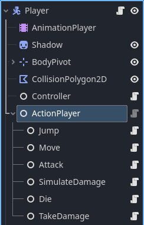

# Modular-Character-Controller-for-Godot v3.0.1
**Compatible Godot Versions:** 4.4, 4.5, 4.6.1 \
**Contact:** pantheradigitalonline@gmail.com \
**Links:**
- [Itch.io](https://pantheradigital.itch.io/godot-modular-character-controller): Leave a **review**, **play** the demo, read **devlogs**, or _donate_
- [Godot Asset Library](https://godotengine.org/asset-library/asset/4283)
- [Demo Video](https://youtu.be/ABDJnFag9q8)
- [Example Projects](https://github.com/PantheraDigital/Modular-Character-Controller-for-Godot-Examples)
<br><br>
[Getting Started](#getting-started) \
| [What Is Included](#what-is-included) \
| [Set Up](#set-up) \
[Using the Modular Character Controller](#using-the-modular-character-controller) \
| [General Overview](#general-overview) \
| [Examples](#examples) \
| [Parts](#parts) \
| | [Action Node](#action-node) \
| | [Action Player](#action-player) \
| | [Action Map Remapper](#action-map-remapper) \
| | [Controller](#controller) \
| [Debug](#debug) \
| | [UI](#ui) \
| | [Logger](#logger) 
<br><br>

# Getting Started
## What Is Included
- [core scripts](addons/modular_character_controller/scripts)
- [debug scripts](addons/modular_character_controller/debug)
- [template scripts](addons/script_templates)
## Set Up
1. Download the [addons](addons) folder
2. Place folder in your Godot project
   - If you have an "addons" folder in your project already then bring the [modular_character_controller](addons/modular_character_controller) folder into that folder
   - [Godot installing-a-plugin tutorial](https://docs.godotengine.org/en/stable/tutorials/plugins/editor/installing_plugins.html#installing-a-plugin)
3. Move the [script_templates](addons/script_templates) to your project at the top level directory "res://"
   - If you have a "script_templates" folder, place the contents of this folder into yours.
   - [Godot project-defined-templates tutorial](https://docs.godotengine.org/en/stable/tutorials/scripting/creating_script_templates.html#project-defined-templates)

# Using the Modular Character Controller 
## General Overview 
The Modular Character Controller is built with the Model View Controller, State, and Component patterns.

- States are no longer concrete classes, they are now composites of components (action nodes).
  - Easy to change behavior at any time, just add or remove a component from a state.
  - Encourages code re-usability since components can be used across many states.

- States are also now action maps (dictionaries), mapping requests (keys/strings) to actions (values/action nodes).
  - Action Player (holder of states) becomes the single point of contact between characters and controllers.
  - Actions can be mapped to any request.
  - Controllers don't need to know the state of a character to make a request.

- Controllers separate input from characters, providing much more freedom and flexibility.
  - Any object can control a character.
  - Any number of controllers can control a single character.
  - A single controller can control any number of characters.

States now look like this: 
```
{ 
  &"grounded":{&"move":^"Move", &"jump":^"Jump", &"attack":^"Attack"}, 
  &"attacking":{&"attack":^"Attack"} 
}
```

And input handling looks like this:
```
func _unhandled_input(event: InputEvent) -> void:
	if event.is_action_pressed(&"jump"):
		action_player.play(self, &"jump")
```
or this:
```
if in_range(target):
    action_player.play(self, &"attack")
```
or this:
```
func _process(_delta: float) -> void:
	var input_direction: Vector2 = Vector2(
		Input.get_axis(&"move_left", &"move_right"),
		Input.get_axis(&"move_up", &"move_down")
	)
	action_player.play(self, &"move", {&"direction":input_direction})
```

The complexity of the system comes into play when implementing the actions. Since actions work together to form a state, thought must be put into how actions work together, if they do. A state may have no actions interact with each other, or it may have actions that block or interrupt other actions. 

When building a character, consider what they can do and what they can be told to do. A character may be able to walk up walls, but can only be told to move forward, backward, left, or right. In this case walking would be the action and how they walk (on ground or wall) is determined by their physics (or other subsystem).

## Examples
You can find examples I have made using this system [here](https://github.com/PantheraDigital/Modular-Character-Controller-for-Godot-Examples). They demonstrate the different ways this system can be used, and how to use it.

Each example project contains the version of this project it was made with so some examples may not be up to date but will function without additional work.

## Parts
### Action Node
[ActionNodes](addons/modular_character_controller/scripts/action_node.gd) hold the game logic needed for a character to perform a specific action, examples would be: moving, looking, attacking, climbing, and even taking damage. The implementation of an ActionNode will vary, similarly to how a function would between different classes. Consider what characters the ActionNode is expected to be attached to and the subsystems on the character already. An ActionNode may perform all the logic needed for an action or coordinate other systems to perform an action, like physics and animation systems to animate and move a character.

The collection of ActionNodes on a character should represent the different things they may do during game play. However, ActionNodes are designed to be removed and added during gameplay to allow characters to be more dynamic, so all ActionNodes do not need to be attached to the character from the start.

A simple example of a move action would look like this:
```
extends ActionNode


const WALK_FORCE = 600

var _character: CharacterBody2D


func _ready() -> void:
	_character = _action_player.get_parent()


## _params: {"direction": float}
func _on_play(_params: Dictionary = {}) -> void:
	if !_params.has(&"direction"):
		return
	
	# turn input into velocity
	var walk = WALK_FORCE * _params[&"direction"]
	_character.input_velocity.x = walk

func _on_stop() -> void:
	_character.input_velocity.x = 0.0
```
To move call: \
`move_action.play({&"direction":Vector2(1,0)})` \
and to stop: \
`move_action.stop()`

### Action Player
The [ActionPlayer](addons/modular_character_controller/scripts/action_player.gd) provides an organized way for objects outside of the character to Play and Stop actions attached to it, without having to find the nodes, by acting as the single point of contact between them. It also allows for control over which actions are accessible to those external objects. The way this works is similar to an API by mapping requests to ActionNodes. The map acts as a public interface for other objects to request actions. 

This looks like \
`{&"move":^"Move", &"jump":^"Jump"}`, where `&"move"` and `&"jump"` are the requests and `^"Move"` and `^"Jump"` are the ActionNodes attached to the ActionPlayer.

Now to Play an action use \
`action_player.play(self, &"jump")`, this will play the ActionNode that is mapped to the request `&"jump"`.

Similarly, to stop and action use \
`action_player.stop(self, &"jump")`.

To change the actions available, or to change which action is called on by a request, use `set_action_map()` or `set_request()`.

`action_player.set_action_map(self, {&"attack":^"Attack"})` will change the map in ActionPlayer to match what is passed in, if the values are valid. Only ActionNodes that are children of ActionPlayer can be used in the map and they can only be mapped to one request at a time.

`action_player.set_request(self, &"attack", ^"Attack")` will change, or add, a request to the map and follows the same rules as `set_action_map`.

Example of ActionPlayer with ActionNodes as children and its action map set in the inspector: \
 

In the above, actions TakeDamage and Die are called directly from the damage system, a subsystem, in the character but will never be called from an object external to the character.

Note that not all ActionNodes need to be added to a map and may be used by the character directly.

Also note that this is where ActionNodes are composed together to form a "state", within the action map. This means the action map can be viewed as the state of a character.

### Action Map Remapper
The [ActionMapRemapper](addons/modular_character_controller/scripts/action_map_remapper.gd) is simply a container to hold multiple mappings a character may have. While the ActionPlayer only holds one map, this holds multiple, allowing for easier swapping during gameplay.

The remapper holds maps:
```
{
&"grounded":{&"move":^"Move", &"jump":^"Jump", &"attack":^"Attack"},
&"attacking":{&"attack":^"Attack"}
}
```

The remapper should be added to the ActionPlayer as a child, like an ActionNode, where it can then be used to modify the active mapping like so:
`remapper.set_active_map(&"attacking")`

This will change the map in ActionPlayer to `{&"attack":^"Attack"}` allowing the character to only attack.

This can be done from within ActionNodes, effectively allowing actions to dictate what a character can do while that action is taking place.

### Controller
A [Controller](addons/modular_character_controller/scripts/controller.gd) can be any object that interacts with the ActionPlayer on a character to have it do things, but a generic script is provided as a base.

Controllers may be in the character scene or separate. \
Due to how the ActionPlayer works, a character can have one or many controllers, and a controller may have one or many characters. \
A Controller does not have to be a player controller, it may be an AI controller or even a movement modifier that adds extra movements to a character.

Here is a simple player controller that uses player input to make requests.
```
extends Controller

var run: bool

func _process(_delta: float) -> void:
	var input_direction: Vector2 = Vector2(
		Input.get_axis(&"move_left", &"move_right"),
		Input.get_axis(&"move_up", &"move_down")
	)
	action_player.play(self, &"move", {&"direction":input_direction, &"run":Input.is_action_pressed(&"run")})

func _unhandled_input(event: InputEvent) -> void:
	if event.is_action_pressed(&"jump"):
		action_player.play(self, &"jump")
	
	if event.is_action(&"run"):
		run = event.is_action_pressed(&"run")
```

## Debug
### UI
A [UI debugger](addons/modular_character_controller/debug/scenes/action_tree_debug_ui.tscn) is provided. It works with and without ActionMapRemapper. The UI will display all requests, the ActionNodes mapped to those requests, if the action is playing, and the names of the maps ActionMapRemapper adds.

### Logger
ActionPlayer, ActionMapRemapper, and ActionPlayerDebugUI make use of the [CustomLogger](addons/modular_character_controller/debug/scripts/logger.gd) class to print out useful debug info if their debug variable is enabled.

This class is named CustomLogger to prevent problems with the Logger class added in Godot 4.5.
