# Modular-Character-Controller-for-Godot
**Contact:** pantheradigitalonline@gmail.com \
**Links:**
- [Itch.io](https://pantheradigital.itch.io/godot-modular-character-controller): Leave a **review**, **play** the demo, read **devlogs**, or _donate_
- [Godot Asset Library](https://godotengine.org/asset-library/asset/4283)
- [Demo Video](https://youtu.be/ABDJnFag9q8)
- [Example Projects](https://github.com/PantheraDigital/Modular-Character-Controller-for-Godot-Examples)

<br/><br/>
**_Update Notes_** \
2.0 not compatible with 1.0. Major restructuring and name changes. \
Tested on Godot versions 4.4, 4.5, 4.6.1
<br/><br/>

[About](#about) \
| [Why This Exists](#why-this-exists) \
[Getting Started](#getting-started) \
| [What Is Included](#what-is-included) \
| [Set Up](#set-up) \
| | [Addon](#addon) \
| | [Examples](#examples) \
[Using the Modular Character Controller](#using-the-modular-character-controller) \
| [Parts](#parts) \
| | [Action Node](#action-node) \
| | [Action Collision](#action-collision) \
| | [Action Manager](#action-manager) \
| | [Action Container](#action-container) \
| | [Permission Container](#permission-container) \
| | [Controller](#controller) \
| [Debug](#debug) \
[Extra Details](#extra-details) \
| [Reference Map](#reference-map)

# About
The Modular Character Controller is built off of the Action System. The Action System handles all the character logic and the Modular Character Controller includes that plus the controller logic.

The Action System can be viewed as a type of state machine, although a very different one in which the name "Adaptive State Machine" may be appropriate.

![Action System VS State Machine. Action System: any number of actions may be active at once, actions dictate functionality, transition actions not needed, action reuse allows few actions to cover many use cases. Better for use cases that can be broken down into groups shared functionality that can be brought together to cover multiple cases. Also ideal for unclear use cases that my require more adaptive or dynamic behavior. State Machine: one state active at a time, states dictate functionality, transition states bloat number of states needed, many use cases require many states. Better for use cases that can be broken down into groups of unique functionality that cover a use case. Also ideal for clear use cases that can be defined before usage.](imgs/diagram-as-vs-sm.png)


The "state" of a character is not predefined as it would be in a typical state machine but would instead be represented by its configuration, that is the Actions that are playing and able to play in any given moment. This makes states adapt to what a character can do rather than states determining what a character can do.

This approach is much more suited to video game characters, especially complex ones, compared to state machines since characters are often dynamic with changing functionality based on many factors (their current action, their environment, their items, other characters affecting them, etc.). This can lead to many cases that need to be covered by many states, which would greatly bloat a state machine due to the rigid nature of states. The Action System approach focuses on dynamic nature by putting the actions a character can perform first, rather than grouping them into fixed states. This reduces code required to cover many cases by taking advantage of identified, reused, actions and allowing the state of the character to adapt to the many factors that will influence them, making it better suited than state machines for the dynamic nature of video game characters.

## Why This Exists
While learning Godot and building my first character I was following tutorials and the examples Godot provides, such as the CharacterBody3D Basic Movement template script. While doing so I noticed my character script growing in complexity, which I did not like as it was difficult to add or remove functionality as the character grew past basic functionality. I realized having a character script is a trap and leads to a monolithic class. In the past I have also used state machines to break down and manage character states, but even back then it all felt messy since transitions would need to be handled and dynamic behavior was hard to manage.

So, after some planning, I broke everything down and eventually came up with this system where the state of a character is no longer a set class, but rather a composite of actions that can play and change more easily.


# Getting Started
## What Is Included
- [core scripts](addons/modular_character_controller/core_scripts)
  - [debug scripts](addons/modular_character_controller/debug)
- [template scripts](addons/script_templates)
## Set Up
### Addon
1. Download the [addons](addons) folder
2. Place folder in your Godot project
   - If you have an "addons" folder in your project already then bring the [modular_character_controller](addons/modular_character_controller) folder into that folder
   - [Godot installing-a-plugin tutorial](https://docs.godotengine.org/en/stable/tutorials/plugins/editor/installing_plugins.html#installing-a-plugin)
3. Move the [script_templates](addons/script_templates) to your project at the top level directory "res://"
   - If you have a "script_templates" folder, place the contents of this folder into yours.
   - [Godot project-defined-templates tutorial](https://docs.godotengine.org/en/stable/tutorials/scripting/creating_script_templates.html#project-defined-templates)
### Examples
You can find examples I have made using this system [here](https://github.com/PantheraDigital/Modular-Character-Controller-for-Godot-Examples).

Each example project contains the version of this project it was made with so some exapmles may not be up to date but will function without additional work.

# Using the Modular Character Controller 
## General Overview 
There are three main parts to the Modular Character Controller: Controller, Action Manager, and Action Nodes.

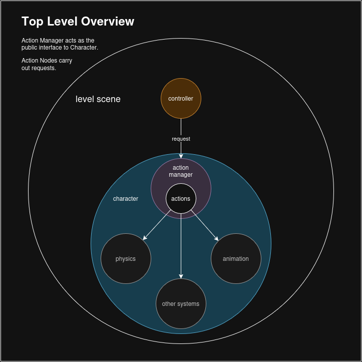

The Controller is any object that will send requests to a character for it to do something.
The Action Manager is the point of contact between a Controller and a character.
The Action Nodes are the implementations of requests, making the character perform the action when played.

This architecture is built on the idea of public and private systems. 

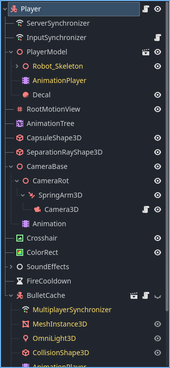

Since the character node ("player" in the above example) is the root of a character scene tree, it is the first node any other object in the level will access when interacting with the character. This makes it the most public since it is the first point of contact and should not hold logic that should not be exposed to all other objects in the level tree.

Continuing this, it is expected a character will have systems, in the form of nodes, in it for handling various things (animations, physics, camera, damage, items, etc.). Some of these will also not be intended for use by objects outside the character but are meant to be used by a player, for example, providing input to command the character to do something.

This architecture separates input handling from the character by using a Controller node. This decoupling keeps functionality more focused and modular since the separation of responsibility makes it so that characters can receive requests from any Controller, or any source.

This is where the Action Manager comes in as the public interface for the character. It works with Action Nodes, which make use of the private systems on a character, to have the character perform actions, such as moving by using the physics and animation systems to move and animate the character. The Action Manager as the public interface allows any object to request actions without exposing systems to all other objects, preventing misuse or breaking of those systems.

Controllers are not limited to player input and Action Nodes are not limited to using other systems in the character.

## Parts
### Action Node
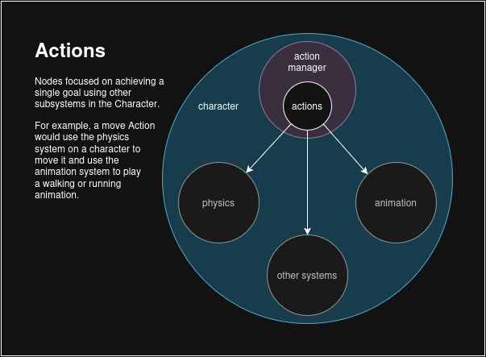

Actions are things a character can do to themselves or in the game world.
Examples of what an Action could be: Move, Look, Attack, Interact, Get Hit, Reconfigure Actions, Equip Item

Actions are not things a player would do, or things that would be meta.
Examples of what an Action is not: Open Inventory, Purchase Item, Level Up, Pause Game, Open Menu

[Action Nodes](addons/modular_character_controller/core_scripts/action_node.gd) handle the logic to perform an action.

This can be tricky as some meta actions that would not be an Action Node may still require the character to do something, such as equipping an item in the UI triggering the character to play an equip animation. While the UI would not be logic in Action Node, a general use Action Node may be used to play the animation.

What an Action Node does will depend on your project.

**Behavior** \
When designing your actions keep in mind they will only ever be told to play or stop. From this there are two main behaviors that can be used, one shot and toggle.

[One Shot](addons/script_templates/ActionNode/one_shot_action.gd): Plays then ends on its own. This type of action can be fired and forgotten as it is more self managing. \
[Toggle](addons/script_templates/ActionNode/toggle_action.gd): Plays till it is told to stop. This action is good for actions that should be active till a request explicitly tells it to stop. 

When choosing a behavior keep in mind that how an action behaves is separate from player input. Planing action behavior before the player input can make input remapping easier.

Also consider that Action Nodes are still Nodes, which allow them to make use of functions like `_process()`.

**Calling** \
Action Nodes are given a type which is what they are requested by.

Using a jump action as an example, it will have a type of "jump". When the player presses the correct button the Controller will request "jump". The Action Manager will then find and play the Action Node with the matching "jump" type.

```
# Controller
var _action_manager: ActionManager 

func _unhandled_input(event: InputEvent) -> void:
  if event.is_action(&"jump") and event.is_action_pressed(&"jump"):
    _action_manager.play_action(&"jump")
```
```
# Jump Action Node
extends ActionNode

var _character: CharacterBody3D

func _init() -> void:
	self.TYPE = &"jump"

func _can_play() -> bool:
	return _character.is_on_floor() and is_playing == false

func _play(_params: Dictionary = {}) -> void:
	# add upward force to _character
	super.__exit()
```

This is used instead of class names or node paths so that multiple actions can share types. Having Action Nodes share types allows you to have more focused implementations of actions. For example you may have two actions that share the "move" type, one fore moving on land and one for moving in water. See [permission_container](addons/modular_character_controller/core_scripts/permission_container.gd) for details on limiting which actions can play for handling shared types.

You can also "override" actions by using shared types. Having two actions share the "jump" type where one action handles basic jumps, then a second action for powered up jumps. The second can be added to the player via power up giving them different jumps. See [action_collision](addons/modular_character_controller/core_scripts/action_collision.gd), priority index, for details on action overriding. 

### Action Collision


Thinking of actions as objects for a moment, for an action to play it must move through all the actions that are currently playing. Some actions may not collide, allowing the action to freely move through and play, but some actions may collide with others where some kind of interaction may take place. You can define these interactions with [action_collision](addons/modular_character_controller/core_scripts/action_collision.gd).

Action Collision also defines a variable for cases where two actions can be selected for a request. This is a special type of collision that happens during selection and is handled by the priority index. The higher priority action will be selected then checked against the playing actions.

Having a character with two jump actions, one for normal jumps and another obtained from a power up giving them special jumps, if the special jump action has its priority index set higher then it will always be chosen over the normal jump action for as long as it is attached to the character.

### Action Manager
The [Action Manager](addons/modular_character_controller/core_scripts/action_manager.gd) decouples input from functionality which allows requests to the character from any object or multiple objects.


When a request is made, the Action Container selects an Action Node with a type matching the request. Only one action will be played per request. Keep in mind multiple actions can still play at the same time.

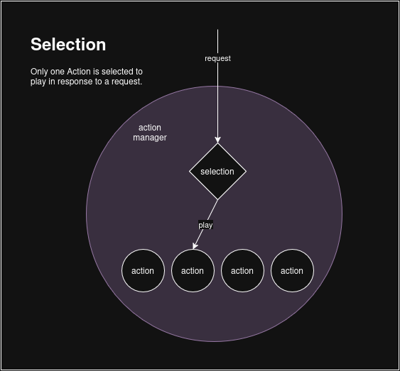

Since there can be many actions on a single character some tools are provided for filtering the actions during selection. See [permission_container](addons/modular_character_controller/core_scripts/permission_container.gd) for details on preventing groups of Action Nodes from being considered during selection. See [action_collision](addons/modular_character_controller/core_scripts/action_collision.gd) for details on choosing a single Action Node when multiple match. Permission profiles are applied first, then collision is used before making a final selection.

The Action Manager also provides additional functions intended to be used by Action Nodes. See the [script](addons/modular_character_controller/core_scripts/action_manager.gd) for details.

### Action Container
[Action_container](addons/modular_character_controller/core_scripts/action_container.gd)s hold the actions attached to the Action Manager in a sorted array so that actions can be found using either their node name or by their action type. Because of this unique node names are enforced across all actions attached to one character.

This is done this way so actions can be found by their type when a play request happens but also so a specific Action Node can be found using their node name. Node names are used internally (within the action system) when seeking a specific node.

### Permission Container
The [Permission Container](addons/modular_character_controller/core_scripts/permission_container.gd) holds permission profiles which indicate the Action Nodes that may be selected based on the active profile. Profiles hold the Node name of the Action Node, which must all be unique from each other on a single character. A profile can hold names in other profiles but not duplicate names within itself.

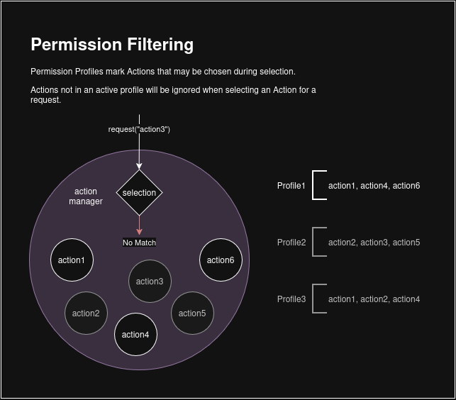

In this diagram "Profile1" is active in the Action Manager which causes the request for "action3" to do nothing since that Action Node is not listed in Profile1.

These profile may be controlled and set from the Action Manager. 

For advanced usage of profiles a tool is provided which allows for the automatic extraction of profiles from the action tree, if the tree uses hierarchy to note which Action Nodes belong to which profiles.

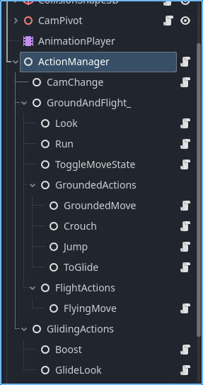 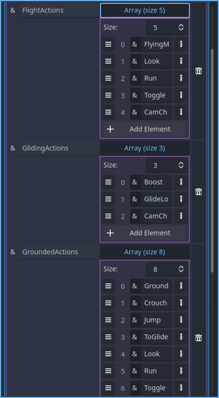

See [action_manager_permission_tool](addons/modular_character_controller/debug/scripts/action_manager_permission_tool.gd) for details.

### Controller
[Controllers](addons/modular_character_controller/core_scripts/controller.gd) are objects that send requests to characters' Action Manager. They may be AI controlled, player controlled, or even some simple logic for sending requests. This may be directly attached to a character or separate.

Multiple Controllers may even control one character. This could be useful for adding effects to a character that add or adjust actions, such as a "dizzy" controller adding random movements.

Controllers can also be used to control many characters at once.

While this class is important to the structure of the action system, this exact class is not required. You may implement your own controller without extending this class.

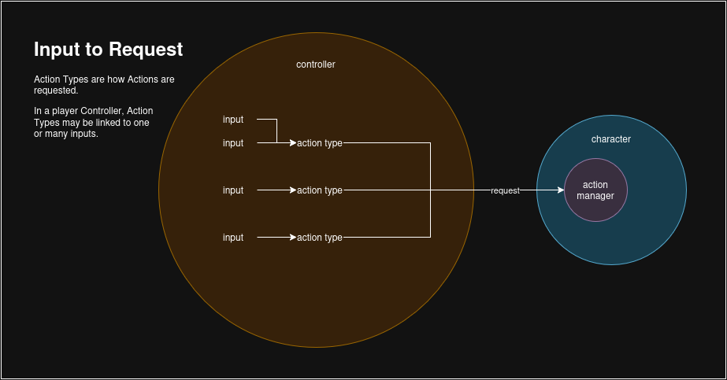

Keep in mind that requests use the type of action they want to happen. This type does not need to be a match to player input.

## Debug
There are two included ways to help with debugging, the [custom_logger](addons/modular_character_controller/debug/scripts/logger.gd) used in action manager and the [action_tree_debug_ui](addons/modular_character_controller/debug/scenes/action_tree_debug_ui.tscn).

The logger gives details on the manager during its setup phase and details on action play requests such as collision or if the action does not exist. This is useful for detailed info on the system, just check the log variable in the inspector of an action manager.

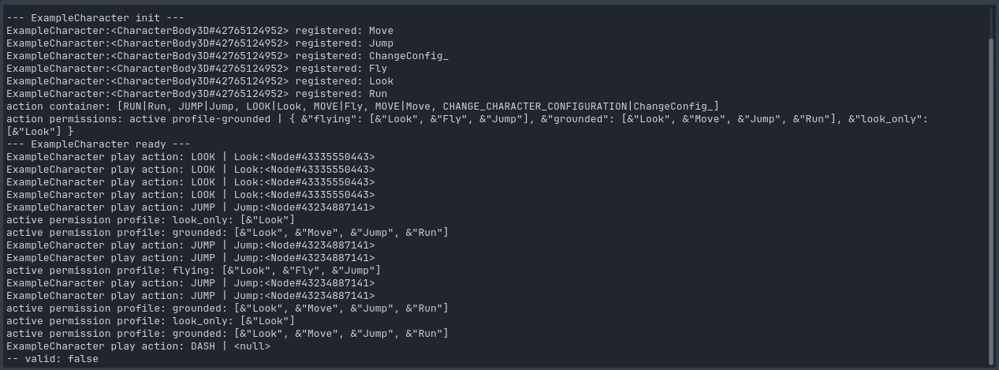

The UI is a scene that will display all actions the manager has access to. It will show which actions can play, are playing, and which can't be played. It will also show the permission profiles and which is active. This is helpful for evaluating complex characters and their actions, as well as ensuring actions are playing properly. Add the scene to any action manager.

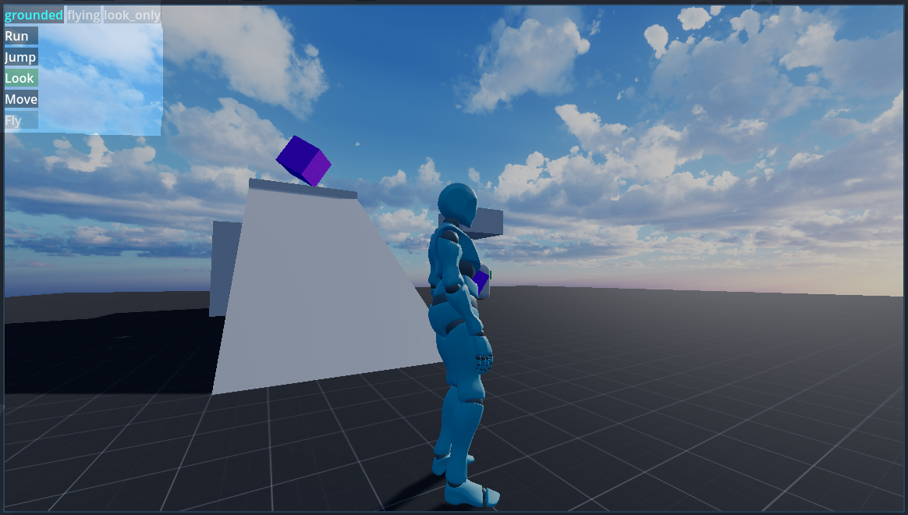

# Extra Details
## Reference Map
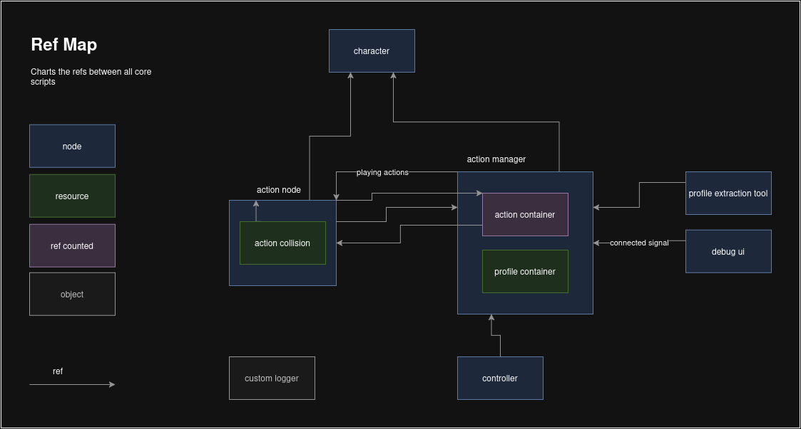
